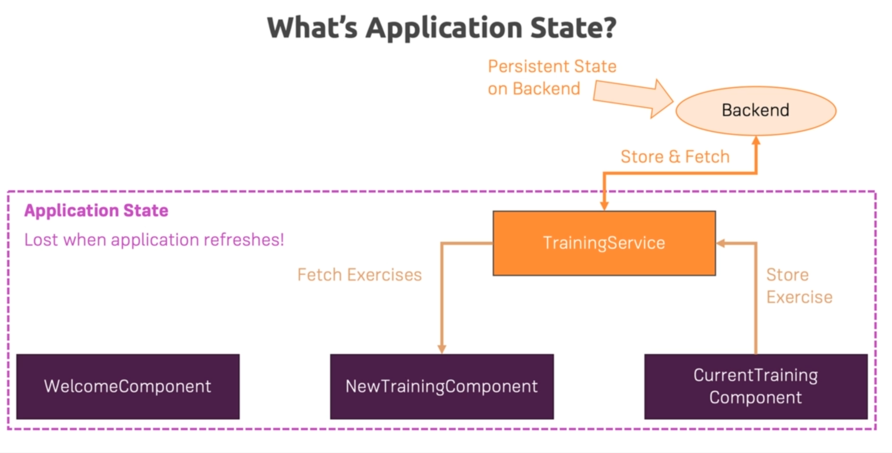
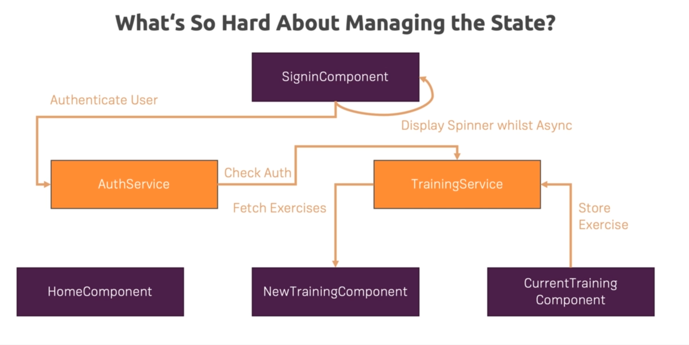
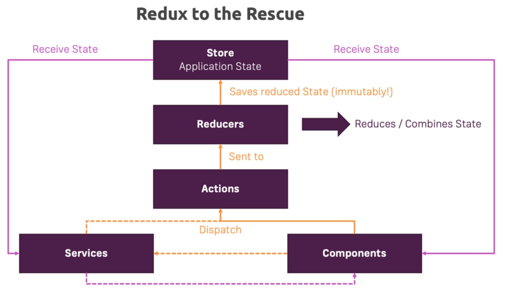
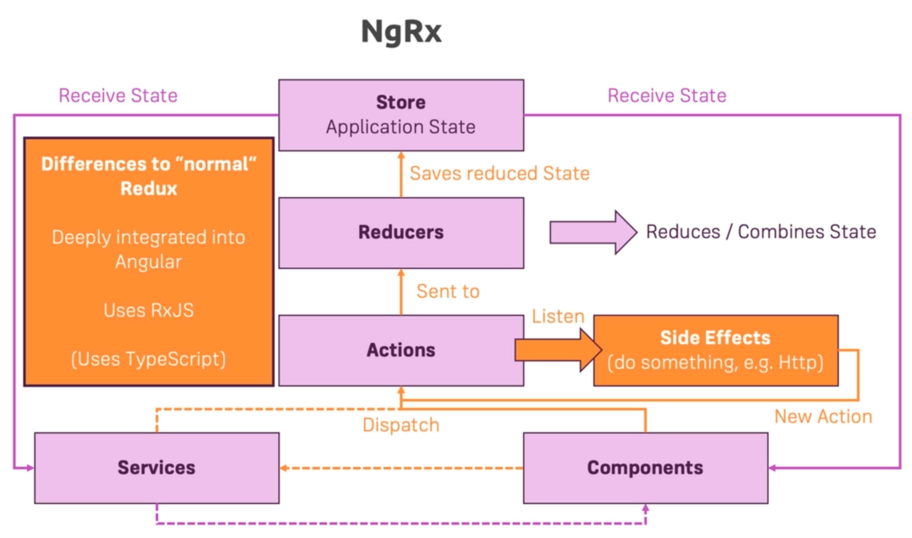

# angular_advanced_fast

## Using Pipes to Transform Output

### Introduction & Why Pipes are Useful

* Used for transforming Output without changing the property

### Attached pipes-start and pipes-final

* Check README in pipes-final

## Making Http Requests

### Attached http-01 to http-09

* Check each projects README starting with http-02

## Course Project - HTTP

* Add prj-http-01 and prj-http-02
* Check README in prj-http-02

## Authentication & Route Protection in Angular

### How Authentication Works

* Client -> Sends Auth Data -> Server(Restful API which is stateless) -> Token
* Client stores token in Storage
* Stored Token is sent to authorize subsequent request

### Attaching auth-01-auth to auth-08

* Check its README

## Dynamic Components

### Module Introduction

* Dynamic Components are Components created at Runtime
* E.g: Showing a Modal, Alert, Overlay which only should be loaded upon certain action like error 

### Attaching dyn-cmp-finished

* Check its README

## Angular Modules & Optimizing Angular Apps

### What are Modules

* Ways of *bundling Angular Building blocks*(Components, Directives, Services, Pipes) together
* Every Angular App requires *atleast 1 Module*(AppModule)
* Angular analyzes NgModules to *understand* your application and its features
* *Core Angular features* are included in Angular modules(e.g. FormsModule) to load them only when needed
* You *can't use a feature/building block* without including it in a Module

### Attaching opt-mod-01 to opt-mod-06

* Check their READMEs

## Deploying an Angular App

### 2. Deployment Preparation & Steps

* Use and Check environment variables
* Polish & Test Code
* ng build --prod
  * Use AOT compilation
* Deploy build artifacts(generated files) to static hosts
  * Because it's only html, js and css

### Add deployment-finished

* Check its README

## Working with NgRx in our Project

### 2. What is Application State

* State: **Data** that is important to our App and influences **what's visible on the screen**

* State in our App like
  * ingredients in ShoppingListService
  * isLoading in AuthComponent

* RxJS to the Rescue with
  * Event in UI/App -> State Changing Event -> Observable -> Operators -> Listener -> Update UI
  * We are doing this with Subjects(e.g recipesChanged)
* Tricky with having proper structure
* NgRx comes into play here

### 3. What is NgRx

* Issues with RxJS Approach
  * State can be updated from anywhere
  * State is (possibly) mutable
  * Handling side effects(e.g Http calls) is unclear
* No Specific pattern is enforced
* This is where Redux comes into picture
* Redux is state management library

* NgRx is Angular's implementation of Redux
