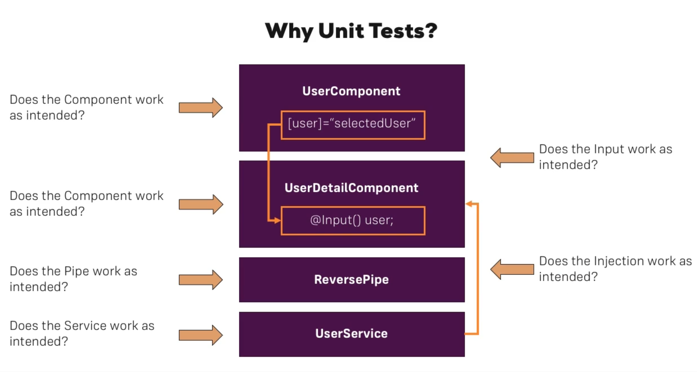
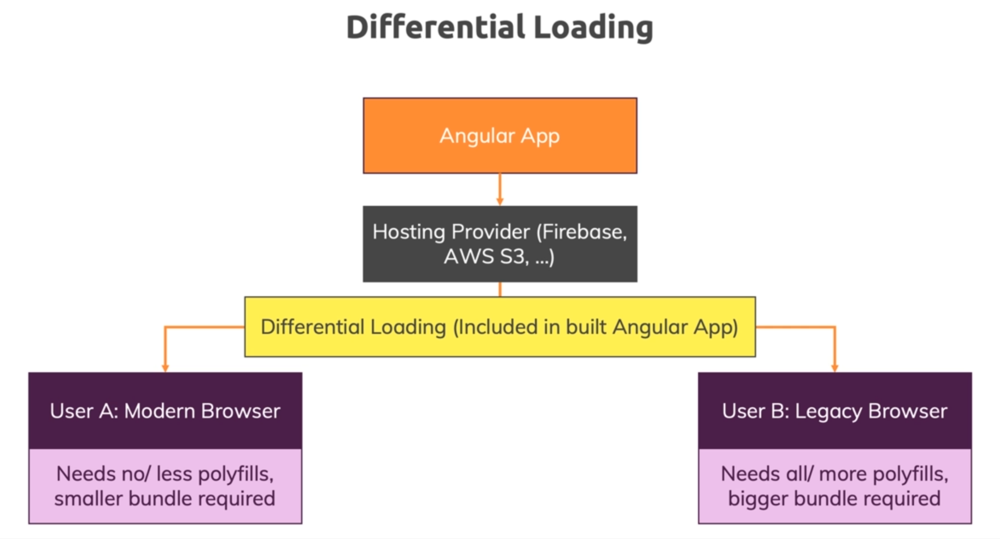
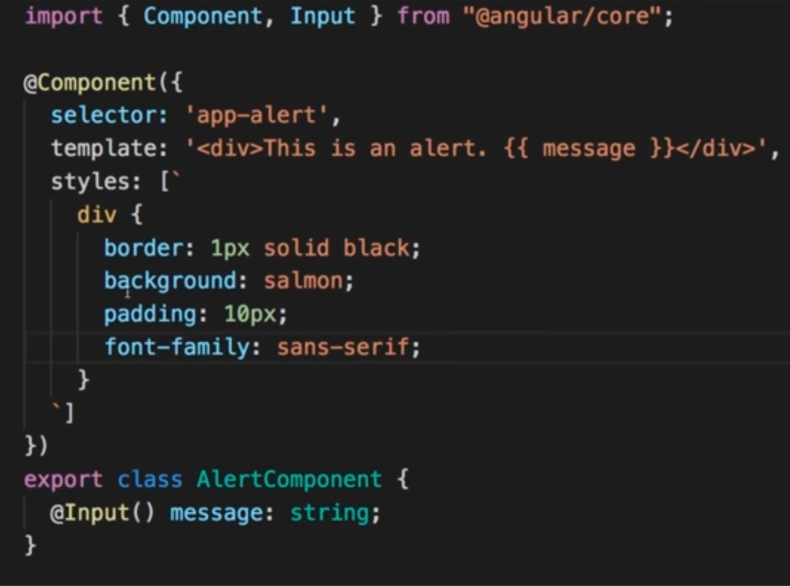

# angular_advanced_fast

## Using Pipes to Transform Output

### Introduction & Why Pipes are Useful

* Used for transforming Output without changing the property

### Attached pipes-start and pipes-final

* Check README in pipes-final

## Making Http Requests

### Attached http-01 to http-09

* Check each projects README starting with http-02

## Course Project - HTTP

* Add prj-http-01 and prj-http-02
* Check README in prj-http-02

## Authentication & Route Protection in Angular

### How Authentication Works

* Client -> Sends Auth Data -> Server(Restful API which is stateless) -> Token
* Client stores token in Storage
* Stored Token is sent to authorize subsequent request

### Attaching auth-01-auth to auth-08

* Check its README

## Dynamic Components

### Module Introduction

* Dynamic Components are Components created at Runtime
* E.g: Showing a Modal, Alert, Overlay which only should be loaded upon certain action like error 

### Attaching dyn-cmp-finished

* Check its README

## Angular Modules & Optimizing Angular Apps

### What are Modules

* Ways of *bundling Angular Building blocks*(Components, Directives, Services, Pipes) together
* Every Angular App requires *atleast 1 Module*(AppModule)
* Angular analyzes NgModules to *understand* your application and its features
* *Core Angular features* are included in Angular modules(e.g. FormsModule) to load them only when needed
* You *can't use a feature/building block* without including it in a Module

### Attaching opt-mod-01 to opt-mod-06

* Check their READMEs

## Deploying an Angular App

### 2. Deployment Preparation & Steps

* Use and Check environment variables
* Polish & Test Code
* ng build --prod
  * Use AOT compilation
* Deploy build artifacts(generated files) to static hosts
  * Because it's only html, js and css

### Add deployment-finished

* Check its README

## Working with NgRx in our Project

### 2. What is Application State

* State: **Data** that is important to our App and influences **what's visible on the screen**

* State in our App like
  * ingredients in ShoppingListService
  * isLoading in AuthComponent

* RxJS to the Rescue with
  * Event in UI/App -> State Changing Event -> Observable -> Operators -> Listener -> Update UI
  * We are doing this with Subjects(e.g recipesChanged)
* Tricky with having proper structure
* NgRx comes into play here

### 3. What is NgRx

* Issues with RxJS Approach
  * State can be updated from anywhere
  * State is (possibly) mutable
  * Handling side effects(e.g Http calls) is unclear
* No Specific pattern is enforced
* This is where Redux comes into picture
* Redux is state management library

* NgRx is Angular's implementation of Redux


### Add ngrx folder

* Check each folder's README

## Angular Universal

### Module Introduction

* Angular runs on the Browser
  * View Page Source
  * script imports at the end is our Angular Application
  * Downside on slower networks
  * Users will see nothing until JS is downloaded in slower networks
  * Search Engine does not see what the user sees
* Angular Universal allows to prerender your Angular App on the Server
  * On the fly Prerender pages Users visit
  * First load is handled on the Server

### Quick Note about ModuleMapLoader

* A quick note: In the next lecture, I mention that it's important to add ModuleMapLoader to your app.server.ts file - if you're using Angular 9, this is NOT required anymore!

## Add angular_universal folder

## A Basic Introduction to Unit Testing in Angular Apps

### Why Unit Tests?


* Unit Tests allows us to
  * Guard against breaking changes
  * Analyze code behavior(Expected and Unexpected)
  * Reveal Design Mistakes
* Also check https://github.com/nuthanc/microservice/tree/master/ticketing#scope-of-testing

## Add testing folder

## Angular as a Platform & Closer Look at the CLI

### 2. A Closer Look at ng new

* sudo npm install -g @angular/cli@latest
* New project using ng new
* ng new --help
  * --create-application(default)
  * --dry-run (without writing out results)
  * --inline-template
  * --prefix
  * --routing
  * --skip-tests
* Official documentation
* ng new angular-config
  * routing: no
  * css

### 3. IDE & Project Setup

* VS Code
* Darcula
* Material Icon Theme
* Angular Essentials by John Papa
* Format Document

### 4. Understanding the Config Files

* .editorconfig
  * Picked up by IDEs and apply configs
* .prettierrc
  * Autoformatting tool
* .gitignore
  * For git to ignore
* angular.json
  * Project configuration
* browserslist
  * Picked up by Angular CLI when we build Project for Production
  * Which browsers to support
* karma.conf.js
  * For testing
  * Unittests
* package.json
  * dependencies and devDependencies(for building our project and not part of running app)
* package-lock.json
  * Exact version saved here based on package.json
* tsconfig.json
  * Configures Typescript Compiler
  * angularCompilerOptions
    * Picked up by Angular Compiler
      * Kicks in after Typescript Compiler which converts TS code to JS code
      * Angular Compiler compiles the Angular App(Compiled JS and HTML templates) into instructions that can be executed at Runtime(Real DOM instructions that the Browser understands)
      * Check Official docs
* tslint.json
  * For code quality

### 5. Important CLI Commands

* ng help
* Official documentation(CLI commands)
* ng serve --help
  * --port, --prod, --open
* ng generate --help
  * ng generate component --help
* ng lint
  * For any linting errors
* ng build --prod
  * dist folder: generated files

### 6. The angular.json File - A Closer Look

* Used by cli behind the scenes
* projectType can be application or library
* architect for different commands like build and options
  * build has many options
  * assets for copying to dist folder
  * scripts for copying over js files(like gmaps, lodash) to dist
  * options contains the default
* Official docs has this info as well
  * Workspace configuration
* configuration for different environments
  * file replacement for environment
  * --configuration=production
  * --configuration=staging

### 7. Angular Schematics - An Introduction

* ng generate
  * Generating new building blocks
* ng add
  * Add libraries and capabilities to a project
* ng update
  * Update projects and libraries
* Custom schematics can also be built

### 8. The ng add Command

* ng add @angular/material
* Makes changes to some project files as well

### 9. Using Custom ng generate Schematics

* ng generate @angular/material:nav main-nav
* Adds on to default schematics

### 10. Smooth Updating of Projects with ng update

* ng update
  * Analyze what needs to be updated

### 11. Simplified Deployment with ng deploy

* Build code for different environments
* ng build/test/lint
  * Perform certain build steps
* ng deploy
  * Perform certain deployment steps
* Customizable automation commands
* Official docs -> Deployment
* ng add @angular/fire
  * Add firebase tools before

### 12. Understanding Differential Loading


* browserslist
  * Browsers to support
* tsconfig.json
  * target for version of js
* polyfills.ts
* polyfills for supporting
* In dist, 2 versions of every file
* es5 -> older browsers
* es2015 -> newer browsers
* index.html
  * runtime executes first and there it decides which other files it needs to load
* Official docs

### 13. Managing Multiple Projects in One Folder

* Multiple projects in one folder
  * ng generate library/application
  * ng generate application backend
* Created under projects folder
  * ng serve --project=backend
  * Just ng serve will run the defaultProject mentioned in angular.json
* If you don't want one project within another project(under projects), you can do the below
* **Recommended way:** ng new angular-shop --create-application=false
  * cd angular-shop
  * ng generate application backend
* Now we have one root folder and the projects in projects folder

### 14. Angular Libraries - An Introduction

* ng generate library my-button
  * Not run as a standalone but shared across multiple applications
  * Like Angular Material
  * ng-package.json file
  * src/public-api.ts file
  * lib folder containing starting files
* Official docs: Angular libraries -> Creating Libraries
* ng-content to pass content from other Components

## Angular Changes & New Features

### First Look at Angular Elements

* Angular Elements
  * Angular Components as Native Web Components(Part of JS API)
  * Useful for loading Dynamic content

* In App Component, instead of 
```html
<app-alert></app-alert>

<!-- Bind to content, where content is a property in Alert -->
<div [innerHTML]="content"></div>
```
```ts
// In App
constructor() {
  setTimeout(() => { // To simulate api call
    this.content = "<p>A paragraph</p>"
  }, 1000)
}

// Using innerHTML to render to the DOM
```
```ts
// Our own component to render dynamically
constructor() {
  setTimeout(() => { 
    this.content = "<app-alert message='Rendered dynamically'></app-alert>" // Coming from api call
  }, 1000)
}

// Not recognized as html element in the browser
```
* npm i @angular/elements
* For the above to work, we need to import createCustomElement from @angular/elements
* Some changes in package.json, app.component and polyfills.ts
  * const AlertElement = createCustomElement(AlertComponent, {injector})
  * customElements.define('my-alert', AlertElement)
* Add entryComponents in app.module
  * Array of Components which we don't use via Selector or Routing
  * Tell Angular that you are eventually going to use it
* Inject Injector and DomSanitizer
* Check official docs

### Updating Existing Projects

```txt
Want to update existing projects? 

ng update should do the trick.

If you're facing issues, visit: http://update.angular.io
```

### TypeScript

* https://www.typescriptlang.org/docs/

## Attaching typescript folder

## Adding Offline Capabilities with Service Workers

* For making it available offline

## Add ng-pwa-02-finished

## Angular Animations

## Attached animations-finished

* Check its README