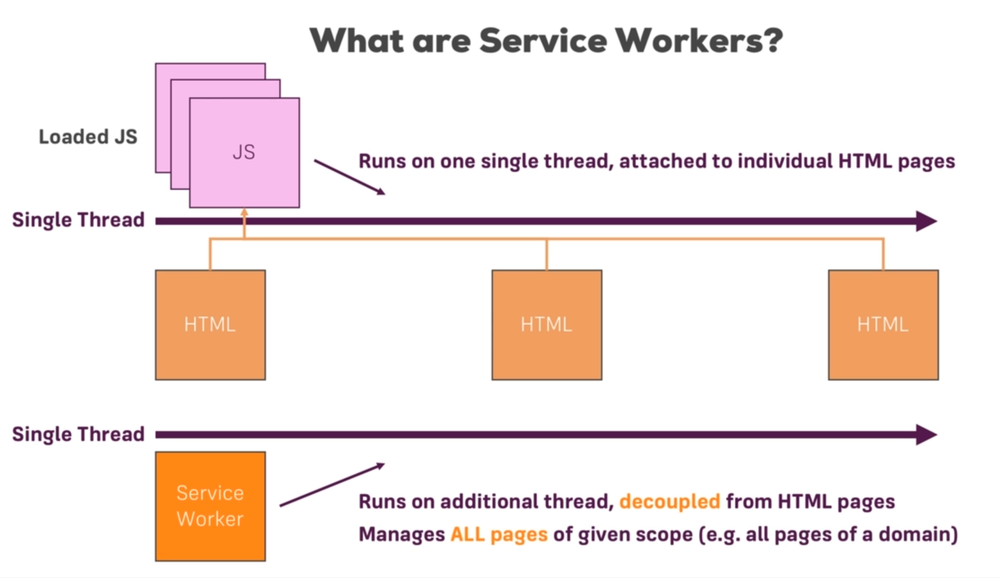

# AngularPwa

### Introduction 

* Inspect -> Application -> Service Workers -> Offline 
* There is no Internet connection

### 2. Adding Service Workers

* Proxy between Frontend App and Backend
* Cache response from Backend and serve it for successive requests without making API call
* ng add @angular/pwa
  * Add something to manifests.json and index.html and app.module.ts an ngsw-config.json and angular.json
* ng build --prod
  * ngsw-worker.js
* npm install -g http-server
  * Simple node based server
  * Host the content of the folder
  * cd dist/angular-pwa
  * http-server -p 8081
* Inspect -> Application -> ngsw-worker.js
* Offline and Reload and it works
* Add static content in app.component.html
* ng build --prod
* cd dist/angular-pwa && http-server -p 8081
* Reload twice because of fetching from cache

### 3. Caching Assets for Offline Use

* Checking ngsw-config.json
* index: Root page which we wanna cache and load
* assetGroups: which static assets should be cached
  * prefetch: When Page loads service worker will go ahead and prefetch all the assets mentioned in assetGroups
  * lazy: Load when only you need them
  * urls in resources for fonts
  * After adding urls, ng build --prod again and serve
* updateMode: After pushing new Angular App and Service worker
* resources relative to dist
* New tab -> new service worker

### 4. Caching Dynamic Assets & URLs

* Checking ngsw-config.json
* dataGroups for dynamic data(HTTP requests)
* Different API version with version
* cacheConfig: 
  * maxSize: how many entries(responses)
  * maxAge: how old before we get rid of and fetch again
  * timeout: wait before using cache
  * strategy: 
    * freshness: Always backend but cache when offline(Takes timeout into account)
    * performance: Get something on the screen as quick as possible(Takes maxAge into account)
* ng build --prod and serve again