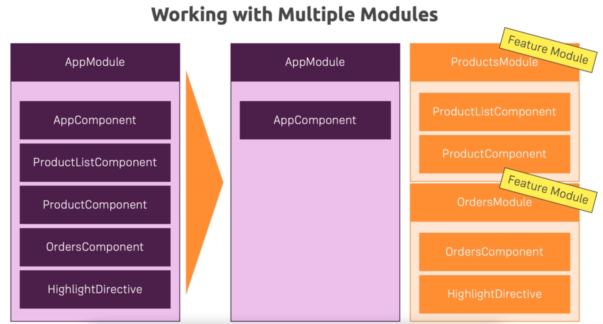

### 3. Analyzing the AppModule

* Check NgModule in AppModule and AppRoutingModule
* declarations contain all the Components, Directives and Pipes that we are going to be using in our App(templates or routes)
* imports allows to import other modules
  * like AppRoutingModule
  * other in-built modules like FormsModule
* providers for all the services
  * AppModule or providedIn: 'root'
* bootstrap for starting the App(Root Component)
  * Which Component in index.html
* entryComponents for Components created in Code(Programmatic Imperative)
* AppRoutingModule contains our Routing configuration
  * We could have added this to AppModule
  * But we outsourced it to keep our AppModule leaner
  * exports for it to become available in another Module
* Every Module works on its own and doesn't communicate with each other by default

### 4. Getting Started with Feature Modules

* Instead of having 1 big AppModule, we can split it to different Feature Modules

* In our source project, we have mainly 3 feature areas
  * recipes
  * shopping-list
  * auth
* header belongs to AppComponent and shared for sharing in different features
* Create RecipesModule in recipes folder
* Move all Recipe related components from AppModule's declarations to RecipesModule's declarations
* Now to use RecipesModule in AppModule
  * Use exports of all Components included in imports in RecipesModule
  * Add RecipesModule in imports of AppModule
* FormsModule and AppRoutingModule won't be available in RecipesModule