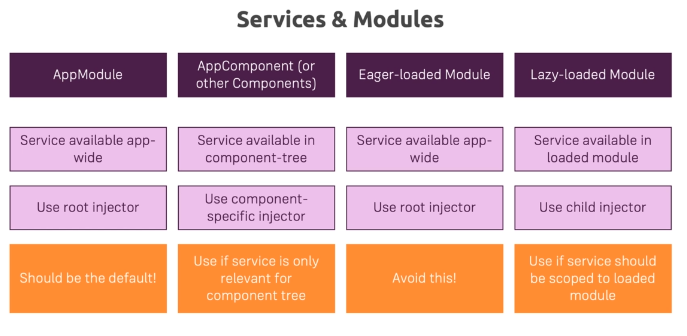
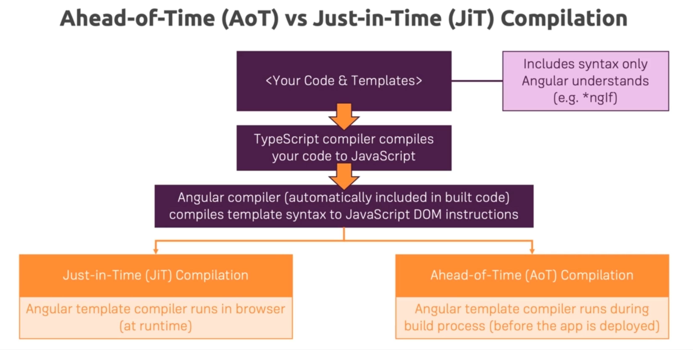

### 15. Preloading Lazy-Loaded Code

* Slight delay in our Application since we need to download when we visit certain parts
* But we can Preload using AppRouting's imports's preloadingStrategy to PreloadAllModules
* Preload the bundles as soon as possible
* E.g: When on auth page, it will preload recipes and shopping-list
* Advantage: Initial loading is fast for Root

### 16. Modules & Services

### 17. Loading Services Differently

* Check logging.service.ts
* CoreModule is eagerly loaded module because it is imported into AppModule
* ShoppingListModule: Lazy loaded module
* Shared: Eagerly loaded because it is imported into AppModule

### 18. Ahead-of-Time Compilation

* By default, ng serve uses JIT compilation(better for debugging)
* ng build --prod
  * This generates a dist folder bundled and optimized version
  * Removes Angular Compiler