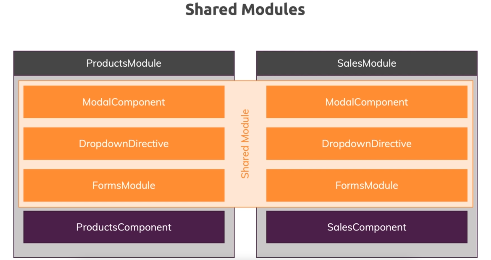

### 7. Component Declarations

* In RecipesModule, we don't have to export Recipe Components because we are not using it in the AppComponent or its children and used only internally

### 8. The ShoppingList Feature Module

* Create Module for ShoppingList similar to Recipes
* Move routing related stuff also to ShoppingListModule and no need to create another file for routing since it includes only 1 Route

### 9. Understanding Shared Modules

* Now moving only CommonModule to SharedModule's imports but any common imports can be added here
* Important: Need to export in exports
* Error that DropdownDirective is part of the declarations of 2 modules
* We can **only declare Components, Directives and Pipes once**
* So remove them from AppModule